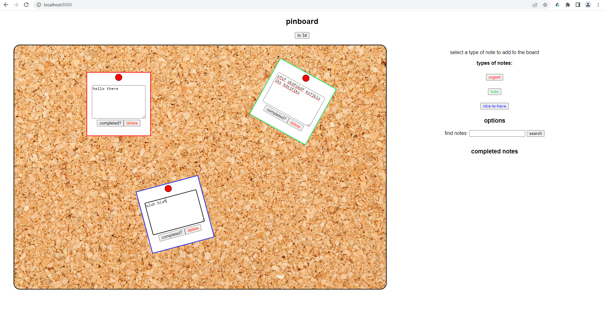

# pinboard    
### a 2d/3d bulletin board idea for helping keep track of things to do    
    
you can toggle between 2d and 3d views of the board and the views will be synced.    
    
    
    
    
    
I also have some basic functionality to sync the view for multiple users in-place thanks to [Yjs](https://github.com/yjs/yjs), a super easy-to-use CRDT implementation! But it's currently just with adding new notes, adding new note text, and note deletion - and on the 2d side only.    
    
To see this in action, after installing the dependencies from `package.json`, run `npx y-websocket` and open up `index.html` on localhost (e.g. through `python -m http.server`).    
    
demo:    
    